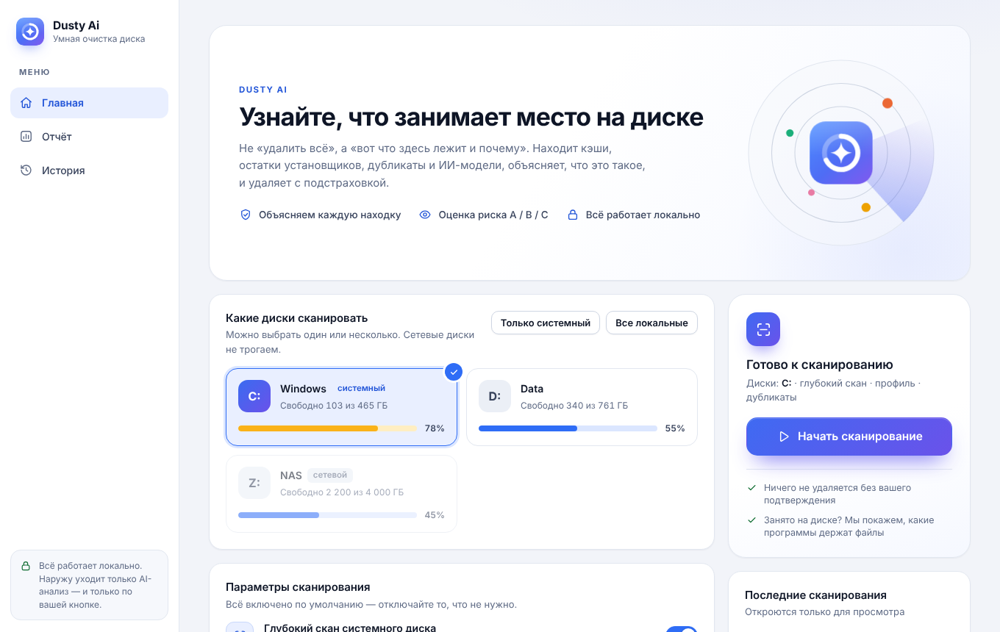
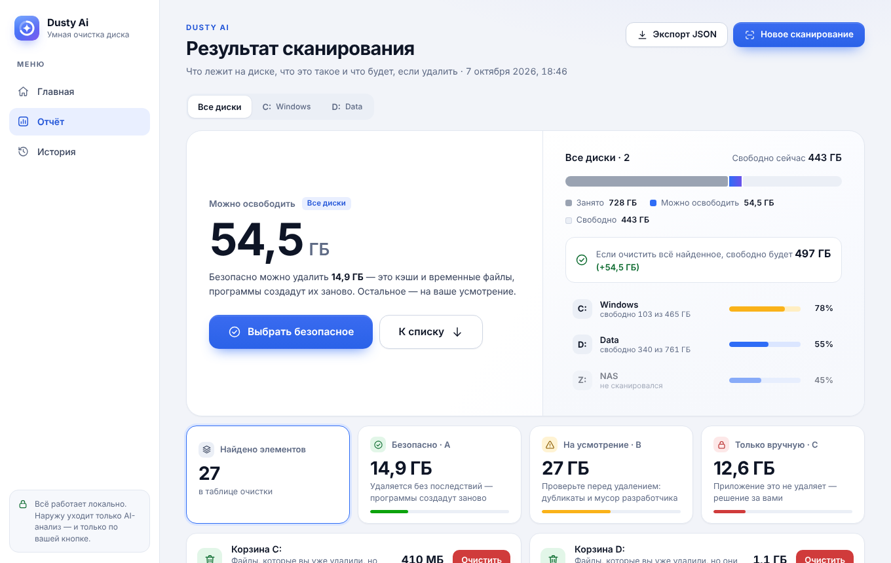
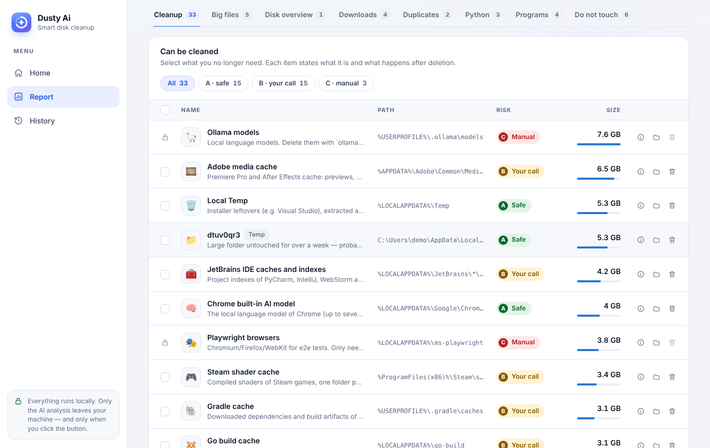
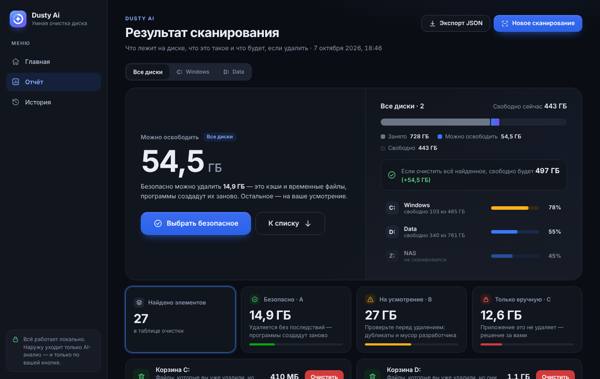
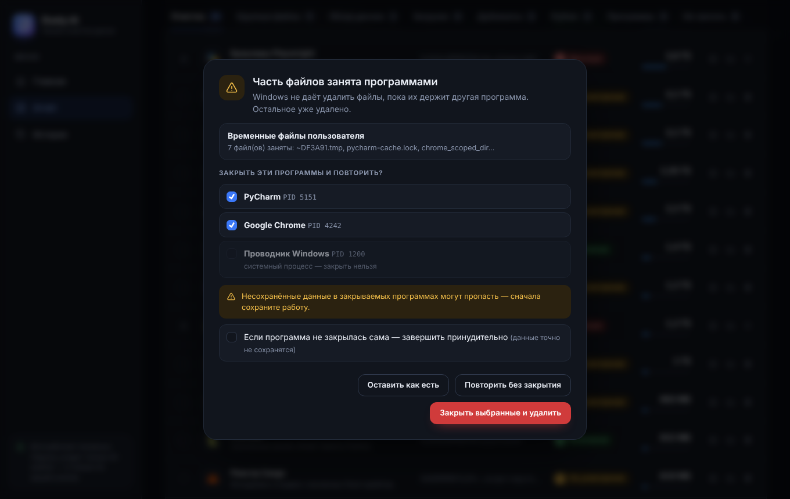

# 🧹 Dusty Ai

A Windows disk cleaner that explains **what** is in a folder and **what happens if you delete it**.
It finds developer caches (npm, Gradle, pip, NuGet, Cargo), installer leftovers, crash dumps and AI models
(Hugging Face, Ollama, Playwright). Runs locally and sends nothing anywhere.

## What it looks like

The interface follows the Windows theme (light/dark) and works fully offline — no fonts or scripts from the internet.

| Home | Report |
|---|---|
|  |  |
| **Cleanup table** — selection, risk, explanation | **Dark theme** |
|  |  |

If a file is in use by a program, Dusty Ai shows which one and offers to close it and retry:



> Screenshots were taken in demo mode with sample data.

## Download

Get the ready-made `DustyAi.exe` (no Python needed) from the **Releases** page, or from the latest
**Build Windows exe** run under *Actions → Artifacts* (`DustyAi-windows`). Releases are created automatically
when a `v*` tag is pushed (e.g. `git tag v1.0.0 && git push origin v1.0.0`).

## Run from source

Windows, Python 3.10+: double-click `run.bat` — the app opens in its **own window** (Flask inside a native window via pywebview/WebView2).

```
pip install -r requirements.txt
python app.py             # app window
python app.py --browser   # same thing in a browser tab
```

Build a single `.exe` locally: `build.bat` → `dist\DustyAi.exe` (PyInstaller, with the icon from `assets/dustyai.ico`).
On Linux/macOS the app starts in demo mode with sample data and deletes nothing.

## Features

- **Custom window:** its own dark/light title bar with minimize/maximize/close buttons and a zoom control; **Ctrl + / − / 0** and **Ctrl + wheel** scale the interface like in a browser. The system title bar can be restored in Settings (or with `--native-frame`)
- **Settings:** theme (system/light/dark), interface scale, scan defaults, how many scans to keep, Cloudflare AI keys, data folder. Settings, history and keys are stored in `%LOCALAPPDATA%\DustyAi` (change with the `DUSTYAI_DATA` variable)
- **Summary at a glance:** how much can be freed, how much of it is safe and how much free space the drive will have; the A/B/C tiles also filter the table
- **Drive selection:** C, D or several at once; the report can switch between drives
- **Whole-drive overview** (including the system drive, except the Windows folder): largest root folders (e.g. `C:\llama`), files of 500 MB+ with type detection (AI model, VM/WSL image, archive, dump…), `node_modules`/`venv`/`__pycache__`, recycle bin. Folders of installed programs are protected: `node_modules` inside Program Files and AppData is never offered for deletion
- **Big files** — a separate tab across all scanned drives: type, modification date, type filter. Any file can be deleted (with confirmation and a warning if it is part of a program or Python package); only the Windows folder and page/hibernation files are blocked
- **Risk filter** above the cleanup table (All / A / B / C) and a **“Select the safe ones”** button: it ticks everything in category A, and deletion still requires confirmation. The selection is collected in a floating bar “N items · X GB”
- **Downloads:** largest files with dates, an “old installer” marker, deletion of the selected ones
- **Profile and AppData overview:** largest folders with no “junk” labels — shows any program the catalog does not know about
- **Programs:** every installed program (not just the top 20), largest first; the **Uninstall…** button launches the standard Windows uninstaller
- Caches and junk from the catalog (`catalog.py`) with a description and an explanation of what gets restored
- **Smart Temp** — installer leftover folders (`*vs_*`, `*setup*`, `*installer*`, or >500 MB) older than 7 days
- **Python** — installations from `py -0p`, heavy packages, a warning if an installation is in use by a process (including an MCP server)
- **Duplicates** — files >50 MB in Downloads and Documents (MD5); one copy always remains
- **App icons** (from exe/registry), charts, a table with selection and batch deletion, categories A/B/C
- **Export** of the report to JSON and a **history** of scans (`scans/`, the last 3 on the home page, view-only)

## AI analysis

The **“✨ AI analysis”** button above the report tabs asks Llama 3.2 3B on Cloudflare Workers AI to briefly explain the results: the main takeaway, what to delete first and what to leave alone. Needs no extra dependencies (only `urllib`).

> **Privacy.** This is the only thing the app sends out, and only when you click. It sends names and sizes of up to seven of the largest findings (grouped as “safe / your call / manual only”) and the total amount of safe junk — **no file paths**.

### Getting a token

1. Sign up or log in at [dash.cloudflare.com](https://dash.cloudflare.com) (the free plan is enough; Workers AI has a free daily limit).
2. **Account ID:** on the account home page, on the right, or under *Workers & Pages → Overview*.
3. **API token:** *My Profile → API Tokens → Create Token → Create Custom Token*. Permission: **Account → Workers AI → Read** (enough to run models; on a 403 error pick the “Workers AI” template). Copy the token — it is shown only once.
4. Open **Settings → AI analysis** and paste the values — or copy `.env.example` to `.env` (next to `DustyAi.exe`, or into `%LOCALAPPDATA%\DustyAi`) and fill them in:

```
CF_ACCOUNT_ID=your_account_id
CF_API_TOKEN=your_token
```

If the answer seems weak, you can set a bigger model in `.env`: `CF_MODEL=@cf/meta/llama-3.1-8b-instruct` (or another one from the Workers AI catalog).

The same variables can be set in the Windows environment — they take precedence over `.env`. The `.env` file is not committed (it is in `.gitignore`); never publish your token.

Without keys the button shows `CF_API_TOKEN not set`. Endpoint: `GET /api/ai-summary` (`?drive=D` — summary for one drive, `?refresh=1` — ignore the cache).

## Safety

- The deletion path is taken only from `catalog.py`; the client sends just an `id` from the whitelist (`DELETABLE_IDS`), otherwise 403.
- Caches are deleted right away, even if an IDE or browser is open. If some files are in use, the app shows **which programs hold them** (Windows Restart Manager) and you decide: close the selected ones and retry, retry without closing, or leave as is. Programs are first asked to close gently (like clicking the X); forced termination is a separate checkbox. System processes cannot be closed, and only programs from the server-determined blocker list can be. The only hard block is cleaning Temp during an installation (`vs_installer`).
- The system Temp and protected folders need administrator rights — use the “🛡 Run as administrator” button in the sidebar.
- Only the cache contents/specific folder is deleted, never a program's root.
- Double confirmation in the UI (resets after 4 s).
- Dynamic items (Temp, duplicates) are re-validated before deletion: path inside Temp/Downloads/Documents, age, presence of an identical copy.
- AI models and Playwright browsers are shown but can only be deleted manually.

## Layout

`settings.py` — user settings and data folder · `winchrome.py` — move/resize of the frameless window · `app.py` — Flask, scan, `/delete`, history, export · `scanners.py` — Temp, Python, duplicates · `util.py` — PowerShell and sizes · `catalog.py`, `catalog_extra.py` — catalog of locations · `templates/` — UI · `assets/` — logo and app icon

### Interface

- `templates/base.html` — shell (sidebar, modal window, notifications) and shared JS helpers
- `templates/_base.css` — design system: color tokens of the light and dark themes, buttons, cards, tabs, forms. Colors and sizes are changed in the `:root` block at the top of the file
- `templates/_icons.html` — SVG icon sprite and brand mark; use as `<svg class="ic"><use href="#i-name"/></svg>`
- `templates/index.html`, `report.html`, `history.html` — pages; the page styles and script live in the same file
- See the interface without Windows: `python app.py --browser` (demo mode, nothing is deleted)
